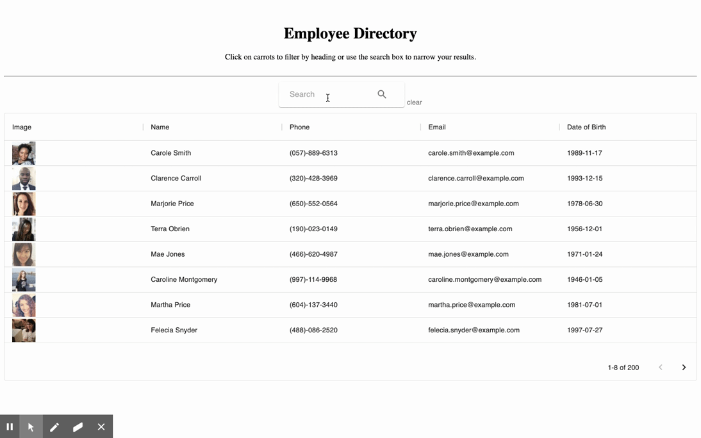

# Employee Directory

## Description

This is an employee directory application build with React. The application allows an employee or manager to view non-sensitive data about other employees and filter employees by name.

## Table of Contents

- [Deployed Application](#deployed-application)
- [Usage](#usage)
- [Installation](#installation)
- [Contributing](#contributing)
- [Questions](#questions)
- [License](#license)

## Deployed Application

[Employee Directory](https://ed-react.herokuapp.com/)

## Usage

- Given a table of random users generated from the [Random User API](https://randomuser.me/), when the user loads the page, a table of employees rendered.

- The table can sort by name and date of birth.

- The table can filter by employees' name.

## Installation

To install necessary dependencies, run the following command:

      npm i

## Contributing

      folk / pull

## Questions

If you have any questions about the repo, open an issue or contact me directly @[xiaoyz28@uw.edu](xiaoyz28@uw.edu). You can find more of my work at [zhuxiaoyu1019](https://github.com/zhuxiaoyu1019).

## License

Copyright (c) Rita Z All rights reserved.

Licensed under the [MIT](https://choosealicense.com/licenses/mit/) license.
